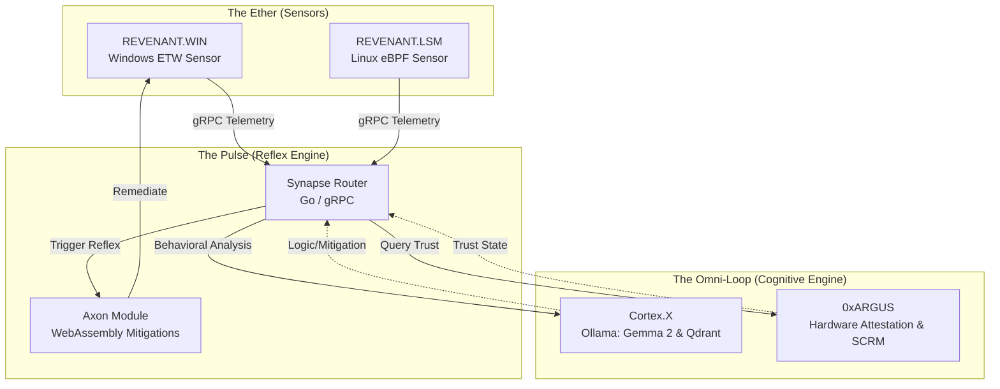
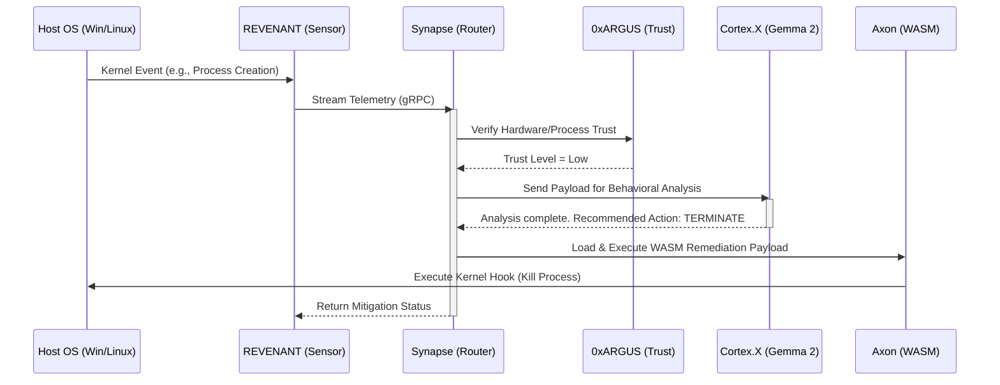

# AETHER-PULSE // OMNI-LOOP
**High-Assurance Autonomic DevSecOps Engine**

AETHER-PULSE is a localized, high-speed, edge-deployed cyber-defense platform. Designed to run completely air-gapped on edge hardware (such as the ASUS ProArt PX13), it seamlessly unifies real-time kernel telemetry, hardware attestation, and localized Large Language Model (Gemma 2) reasoning to identify and neutralize advanced threats automatically.

---

## 🏗️ Architecture Diagram



## 🔄 Process Flow Diagram



## 🚀 Getting Started

1. **Start the Cognitive Cluster**
   ```bash
   docker compose up -d
   ```
   *This brings up Ollama, Qdrant, and the dual 0xARGUS engines.*

2. **Start the Synapse Router**
   ```bash
   cd synapse-core
   go run main.go
   ```

3. **Start the Kernel Sensors**
   ```bash
   cd ../REVENANT.WIN
   cargo run
   ```

4. **Monitor the Loop**
   Right-click the `AetherTray.ps1` orb in your Windows taskbar to see live threat status!

## 📚 Documentation
Full documentation is built with MkDocs.

## 🛡️ Ecosystem Alignment
AETHER-PULSE is designed to seamlessly integrate with the broader high-assurance ecosystem:
*   **Railhead:** Acts as the secure, zero-trust deployment and orchestration layer for rolling out AETHER-PULSE sensors and updates across edge networks.
*   **Keystone:** Provides the foundational secure enclaves, identity, and cryptographic key management that deeply anchor the `0xARGUS` hardware attestation chains.
```
